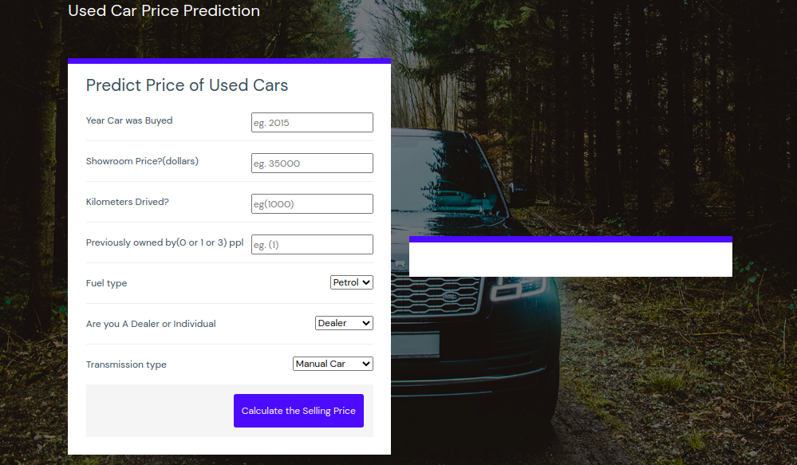

# Used Car Price Prediction Model
Use this link to see the web hosted on heroku [here](https://used-car-prediction-ml-model.herokuapp.com/)

This data science project walks through how to build end to end machinel learning project used on real estate price prediction website. I have first build a model using sklearn and decision tree regressor using real estate dataset from [kaggle](https://www.kaggle.com/davivieirab/real-estate-data-brazil)Second step was to write a python flask server that uses the saved model to serve http requests. Thirdly I will use template from the web for building website in html, css and javascript that allows user to enter home square ft area, bedrooms etc and it will call python flask server to retrieve the predicted price using my model. During model building I have used a end to end machine learning tools and concepts such as data loading and cleaning, outlier detection and removal, feature engineering, dimensionality reduction, gridsearchcv for hyperparameter tunning, k fold cross validation etc. Technology and tools wise this project covers,

1. Python
2. Numpy and Pandas for data cleaning
3. Matplotlib for data visualization
4. Sklearn for model building
5. Jupyter notebook, visual studio code as IDE
6. Python flask for http server
7. HTML/CSS/Javascript for UI

# Deploy this app to cloud (on azure machine learning studio)

